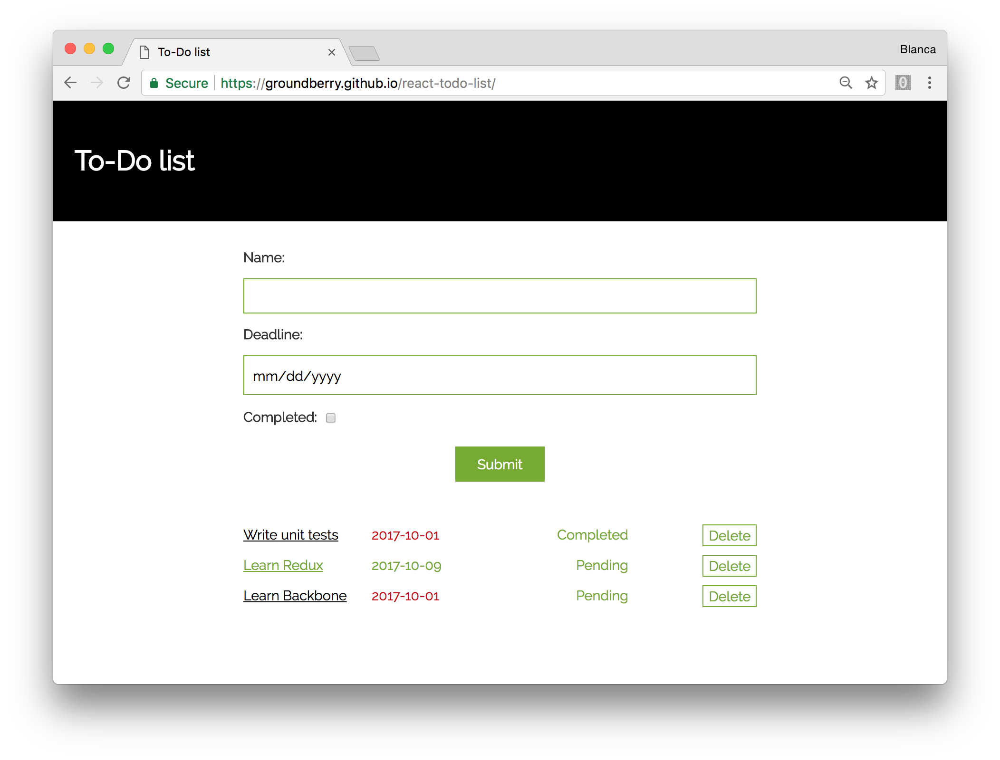

# To-Do List

Create-react-app to manage tasks.

## Functionality

- As a user, I can add a task to the list.
- As a user, I can see all the tasks on the list in an overview.
- As a user, I can drill into a task to see more information about the task.
- As a user, I can delete a task.
- As a user, I can mark a task as completed.
- As a user, when I see all the tasks in the overview, if today's date is past the task's deadline, highlight it.




## Running the app

Clone this repo:

```
$ git clone https://github.com/groundberry/react-todo-list
```

Install all dependancies:

```
$ npm install
```

Start the server:

```
$ npm start
```

And open the app in your browser at <http://localhost:3000/>.

## Testing the app

Run the tests:

```
$ npm run test
```


## Useful documentation

- [React documentation](https://reactjs.org/)
- [Create-react-app documentation](https://github.com/facebookincubator/create-react-app)
- [Enzyme](https://github.com/airbnb/enzyme)
